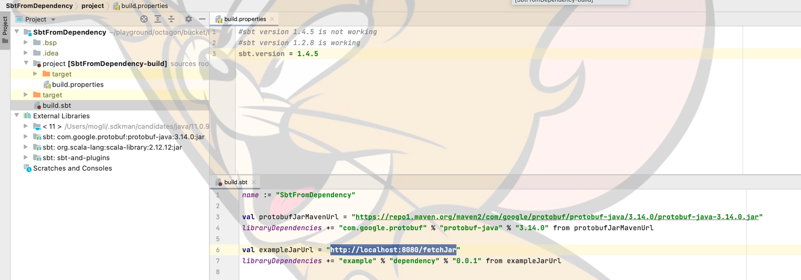
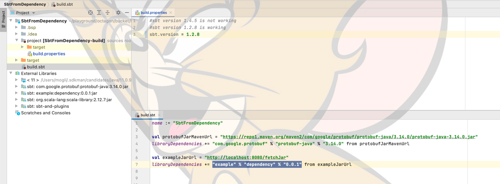

**[DESCRIPTION]**   

This is a simplified example to reproduce below problem statement :-   
`libraryDependencies += sbt from "some url"`   
successfully downloads dependency if sbt.version is 1.2.8 in project/build.properties,   
but dependency is not downloaded, if sbt.version is 1.4.5 in project/build.properties.   

---

**[STEPS]**   

Step 1] simplified jar is required, that can be fetched from a http url.   

Step 2] one sbt project build.sbt is required with dependency on above simplified jar   

`libraryDependencies += sbt from "url of simplified jar"`

---

**[PROJECT]**   

Step 1 :-   
There is a multi-module sbt project DependencyAndService with   
first module Dependency from which sample jar will be created, and   
second module Service, that will be used to serve jar over http.

`sbt clean compile run`  
from DependencyAndService directory will create sample dependency   
and start service to serve jar over http.

Step 2 :-   
load SbtFromDependency sbt project in intelllij and verify that   
"example" % "dependency" % "0.0.1" is not there in External libraries

   

Now, modify sbt.version to 1.2.8 in SbtFromDependency/project/build.properties and verify that   
"example" % "dependency" % "0.0.1" is there in External libraries

